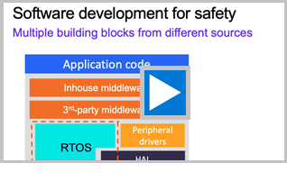

[**Arm Examples**](README.md) » **Functional Safety**

## Functional Safety

The [MDK Professional Edition](https://www.keil.arm.com/keil-mdk/#mdk-v6-editions) includes safety features that help developers achieve compliance with standards like ISO 26262 (Automotive), IEC 61508 (Industrial), and IEC 62304 (Medical). It includes the [Arm Compiler for Embedded FuSa](https://developer.arm.com/Tools%20and%20Software/Arm%20Compiler%20for%20Embedded%20FuSa) and the [Arm FuSa Run-Time System](https://developer.arm.com/Tools%20and%20Software/Keil%20MDK/FuSa%20Run-Time%20System). For integration of third-party tools for static code analysis and MISRA checking, Keil Studio creates a standard database.

 

 

As detailed in [Application Note (KAN345)](https://developer.arm.com/documentation/KAN345/latest), FuSa RTS provides a set of TÜV Süd certified software components: Keil RTX RTOS, FuSa Event Recorder, FuSa CMSIS-Core for processor access, and FuSa C library specifically implemented for safety applications. The [Application Note (KAN326) - Using X-CUBE-STL with Arm FuSa RTS](https://developer.arm.com/documentation/kan326/latest/) explains how to integrate the STMicroelectronics [X-CUBE-STL](https://www.st.com/en/embedded-software/x-cube-stl.html) Software Test Libraries that detect random hardware failures.

FuSa RTS includes process isolation capabilities by preventing undesired interference between software components with different safety integrity levels. Spatial isolation is enforced through MPU Protected Zones that control access to memory and peripherals. Safety Classes implement access control to RTOS objects and kernel operations. Temporal isolation is achieved through Thread Watchdog mechanisms that monitor timing constraints, while Controlled System Recovery provides mechanisms to block execution of non-safety application components and to proceed to a safety state operation in case of failures.

### Traffic Light Safety Example

The [Safety-Example-STM32](https://github.com/Arm-Examples/Safety-Example-STM32) repository demonstrates functional safety concepts on STMicroelectronics devices using Keil Studio. The `TrafficLight.csolution` showcases FuSa RTS process isolation features including safety classes, MPU protected zones, and fault handling in a practical traffic light controller scenario. These examples use the open-source Keil RTX for evaluation purposes with the MDK-Community edition, providing similar functionality to the commercial FuSa RTS. The repository demonstrates integration with the CMSIS-Toolbox and CI workflows, including GitHub Actions for automated builds and hardware-in-the-loop testing on a NUCLEO-H563ZI board.

The [Safety-Example-Infineon-T2G](https://github.com/Arm-Examples/Safety-Example-Infineon-T2G) is a similar example, but uses the MPU integrated in Cortex-M7 and showcases the setup on a multicore device.
