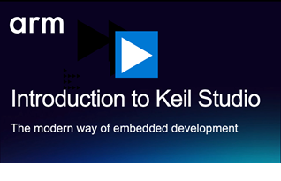
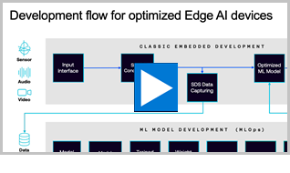

# Examples for Embedded Developers

Arm-Examples contains ready-to-run embedded projects showcasing RTOS, machine learning, functional safety, and CI/CD automation across diverse Arm-based hardware platforms. 

These examples leverage Keil Studio, CMSIS-Toolbox, and Arm FVP models with various compilers (Arm Compiler 6, GCC, LLVM) enabling both desktop and cloud-based CI/CD workflows with physical hardware and simulation models.

Keil Studio is Arm's new IDE for embedded development directly in Visual Studio Code and the successor to the µVision IDE. ****

 

## RTOS Applications

Keil Studio is designed for all types of embedded projects, ranging from bare-metal firmware to complex RTOS-based systems. How to choose the right option: bare-metal, Keil RTX, FreeRTOS, and Zephyr? [**Learn more ...**](BareMetal2RTOS.md)

| Repository | Hardware | Content |
|------------|----------|---------|
| [Hello_NUCLEO-G474RE](https://github.com/Arm-Examples/Hello_NUCLEO-G474RE) | ST NUCLEO-G474RE | Keil RTX configuration; prints "Hello World, 0..9" on the serial console. |
| [Middleware_USB_FS](https://github.com/Arm-Examples/cmsis-mlek-examples) | Alif Ensemble E7 | Pre-configured machine learning (ML) projects using the ML Embedded Evaluation Kit. <a href="https://armkeil.blob.core.windows.net/developer/Files/videos/KeilStudio/20250812_Multicore_Alif.mp4" target="_blank">Watch the related webinar</a>. |
| [CMSIS-Zephyr](https://github.com/Arm-Examples/SDS-Examples) | Various | Examples showing the usage of the Synchronous Data Streaming (SDS) Framework. <a href="https://armkeil.blob.core.windows.net/developer/Files/videos/KeilStudio/20250916_SDS_Webinar.mp4" target="_blank">Watch the related webinar</a>. |

## Edge AI and Machine Learning

Comprehensive machine learning capabilities are available with ML Evaluation Kit (MLEK), Synchronous Data Streaming (SDS) Framework, LiteRT (TensorFlow), and Executourch that utilizes CMSIS-NN (for Cortex-M) or Vela (for Ethos-U). **[Watch this video to learn more...](https://armkeil.blob.core.windows.net/developer/Files/videos/KeilStudio/20250812_Multicore_Alif.mp4?#t=07:22 "Development flow for optimized Edge AI devices")**

 

 

| Repository | Hardware | Content |
|------------|----------|---------|
| [CMSIS-MLEK-Examples](https://github.com/Arm-Examples/cmsis-mlek-examples) | Alif Ensemble E7 |  Pre-configured machine learning (ML) projects using the ML Embedded Evaluation Kit. <a href="https://armkeil.blob.core.windows.net/developer/Files/videos/KeilStudio/20250812_Multicore_Alif.mp4" target="_blank">Watch the related webinar</a>. |
| [SDS-Examples](https://github.com/Arm-Examples/SDS-Examples) | Various | Examples showing the usage of the Synchronous Data Streaming (SDS) Framework. <a href="https://armkeil.blob.core.windows.net/developer/Files/videos/KeilStudio/20250916_SDS_Webinar.mp4" target="_blank">Watch the related webinar</a>. |
| [CMSIS-Executorch](https://github.com/Arm-Examples/CMSIS-Executorch) | Ethos-U | Project template for embedded applications with Arm Ethos-U that use ExecuTorch AI models |

## Functional Safety (FuSa RTS)

The [MDK Professional Edition](https://www.keil.arm.com/keil-mdk/#mdk-v6-editions) includes safety features that help developers achieve compliance with standards like ISO 26262 (Automotive), IEC 61508 (Industrial), and IEC 62304 (Medical). It includes the [Arm Compiler for Embedded FuSa](https://developer.arm.com/Tools%20and%20Software/Arm%20Compiler%20for%20Embedded%20FuSa) and the [Arm FuSa Run-Time System](https://developer.arm.com/Tools%20and%20Software/Keil%20MDK/FuSa%20Run-Time%20System).

**[Watch this video](https://armkeil.blob.core.windows.net/developer/Files/videos/KeilStudio/20250930_FuSa_TRAVEO.mp4?#t=01:35 "Software development for safety critical applications")**, explore the projects below or read the section [**Functional Safety**](FuSa.md) to learn more.

 

 

| Repository | Hardware |  Content |
|------------|----------|----------|
| [Safety-Example-Infineon-T2G](https://github.com/Arm-Examples/Safety-Example-Infineon-T2G) | Infineon Traveo T2G | [Fusa RTS](https://developer.arm.com/Tools%20and%20Software/Keil%20MDK/FuSa%20Run-Time%20System) traffic light example, CMSIS-Driver development and verification. <a href="https://armkeil.blob.core.windows.net/developer/Files/videos/KeilStudio/20250930_FuSa_TRAVEO.mp4" target="_blank">Watch the related webinar</a>. |
| [Safety-Example-STM32](https://github.com/Arm-Examples/Safety-Example-STM32) | STM32H5 | [Fusa RTS](https://developer.arm.com/Tools%20and%20Software/Keil%20MDK/FuSa%20Run-Time%20System) traffic light example. <a href="https://armkeil.blob.core.windows.net/developer/Files/videos/KeilStudio/20250930_FuSa_TRAVEO.mp4" target="_blank">Watch the related webinar</a>. |

## CI/CD Automation (GitHub Actions)

Most of the above example projects include GitHub actions that run a build or execution test. The following projects help to get started with test automation.

| Repository | Hardware used | Tool/IDE | Notes |
|------------|---------------|----------|-------|
| [AVH_CI_Template](https://github.com/Arm-Examples/AVH_CI_Template) | FVP_MPS2_Cortex-M3 | CI Template for unit test automation |
| [AVH-Hello](https://github.com/Arm-Examples/AVH-Hello) | Multiple FVP simulation models | CI project with a test matrix that uses GitHub Actions on a GitHub-hosted runner. |

## Related

- Software Packs maintained by Arm
- [Other Examples](ListExamples.md)
